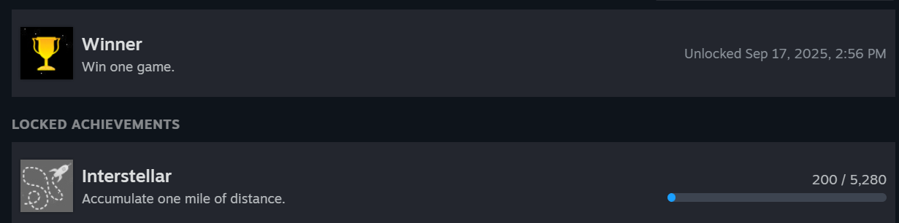
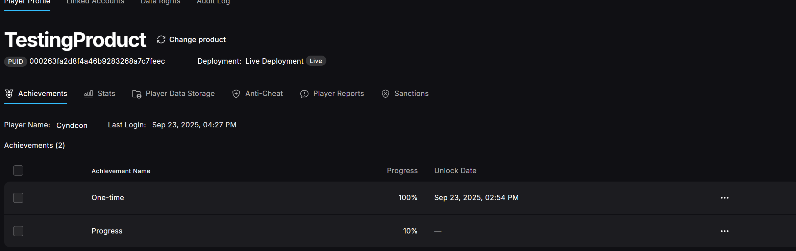
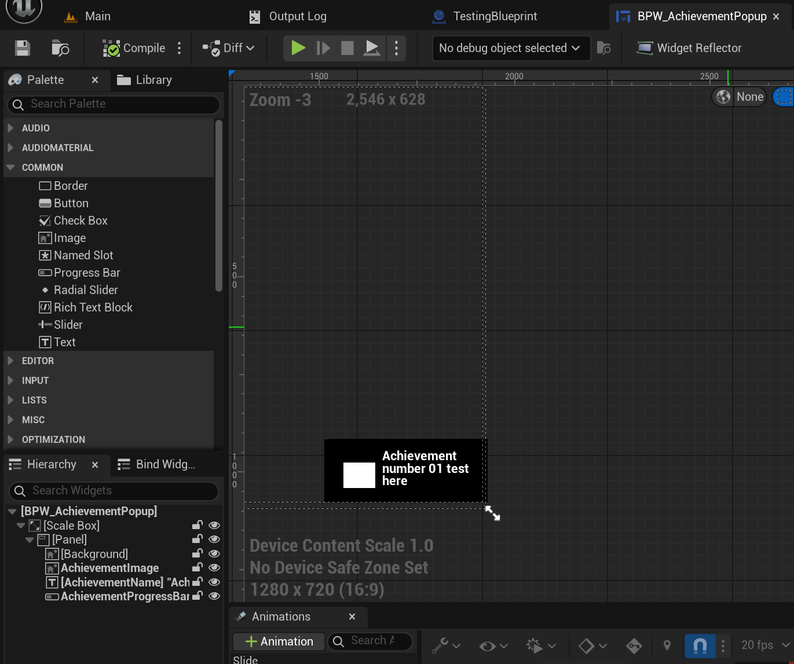
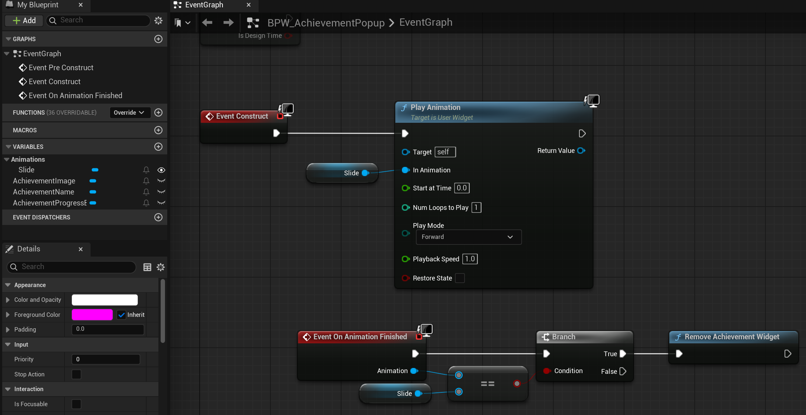
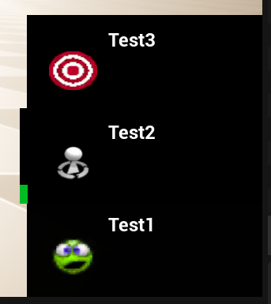

The goal for this project was to **make an achievement plugin that supports local achievements, with support to sync progress to Steam and Epic, with custom UI popups and all of this should be able to be controlled via Blueprint, with no C++ required**.  

Note: This next part will be all about me explaining why I made this and some research I did beforehand. If you'd prefer to skip to the actual code, [please go here](#achievement-data).   
If you are interested in the actual FAB page, [that one can be found right here](https://www.fab.com/listings/c9b10eac-d007-49e9-a546-97976c882f78).  
For the Github repo (including the entire wiki for this plugin), [please go here instead](https://github.com/Cyndeon/Achievement-Plugin-UE5).

I made this project for school while attending Buas. We were allowed to make something of our choice, with the only hard requirements being that it had to be written mostly in C++ and it had to work with a pre-existing library or engine, so making a plugin for Unreal, or perhaps some extension for Godot or Blender or other software would have been fine. We needed to learn how to make something that expands upon and used pre-existing code, since, in the world we will enter eventually, we will (likely) never start completely from scratch.

I decided to make a plugin for Unreal since I was going to be working a lot with Unreal in the future and I thought it'd be good to have some experience in working with Unreal Engine C++. I already did so a couple months ago, but that was so basic that I didn't get to delve too deep in how C++ works with Unreal Engine 5.  
As somewhat of an achievement hunter (someone who likes to focus on collecting all achievements in a game), I thought it'd be fun and interesting to create an achievement plugin for UE5 that can sync with Steam and Epic games so people can easily make their own achievements at least locally and then also for Steam and/or Epic if they so choose. I wanted to post this to FAB eventually as well so that everyone would be able to use my plugin for achievements. This would hopefully allow anyone to have an achievement system, whether you're posting it to Itch or Gamejolt or the bigger platforms like Steam and Epic.

Not only would this teach me more about UE5's C++, but also how to make a plugin in there, I also would get to work with multiple SDKs, how to publish my own content to FAB, how to optimize my data management and much more.

Because I wanted this to be usable for all of the projects I worked on while at BUAS, I made sure to support multiple versions of Unreal Engine. By default, in order to upload to FAB, the plugin had to support the latest version, which, at the time, was 5.7, which had just released. I also already had 5.6 installed, but most of the projects I was working on used 5.5. So, I made versions for 5.5, 5.6 and 5.7.

As of writing this in Feb 2026, I am working on an update for the plugin that will allow the user to also have an achievement list, this post will be updated at some point after the update has been posted to FAB.
___
### Achievement Data
Local achievements:  
They are split up into multiple parts, the achievement itself, and the progress towards that achievement and the variables required for other platforms:

```cpp
USTRUCT(BlueprintType)
// this struct has all the data that is inside the developer settings, ReadOnly for blueprints
struct ACHIEVEMENTPLUGIN_API FAchievementData : public FLinkedStruct
{
	GENERATED_BODY()
public:
#if WITH_EDITOR
	void UpdateProgressEditorOnly(const FAchievementProgress& progress)
	{
		m_currentProgress = progress;
	}
#endif
	UPROPERTY(EditAnywhere, BlueprintReadOnly, Category = "Developer")
	bool isHidden = false;

	UPROPERTY(EditAnywhere, BlueprintReadOnly, Category = "Public")
	FText displayName;
	UPROPERTY(EditAnywhere, BlueprintReadOnly, Category = "Public")
	FText description;
	UPROPERTY(EditAnywhere, BlueprintReadOnly, Category = "Public")
	TSoftObjectPtr<UTexture2D> lockedTexture;
	UPROPERTY(EditAnywhere, BlueprintReadOnly, Category = "Public")
	TSoftObjectPtr<UTexture2D> unlockedTexture;
	UPROPERTY(EditAnywhere, BlueprintReadOnly, Category = "Public", meta = (ClampMin = "0"))
	int32 progressGoal = 1;

	// Platform-specific identifiers
	UPROPERTY(EditAnywhere, BlueprintReadOnly, Category = "Platforms",
			  meta = (DisplayName = "Platform Data"))
	FAchievementPlatformData platformData;
#if WITH_EDITORONLY_DATA
private:
	// Runtime data (visible only here but not editable, NOT saved to config)
	UPROPERTY(VisibleAnywhere, Transient, Category = "Runtime Stats",
			  meta = (DisplayName = "Current Progress (NOT LIVE)"))
	FAchievementProgress m_currentProgress = FAchievementProgress();
#endif
};
```

```cpp
USTRUCT(BlueprintType)
// this struct has all the data that can be changed during runtime, ReadWrite for blueprints
struct ACHIEVEMENTPLUGIN_API FAchievementProgress
{
	GENERATED_BODY()
public:
	FAchievementProgress() = default;

	UPROPERTY(EditAnywhere, BlueprintReadWrite, meta = (ClampMin = "0"), SaveGame)
	float progress = 0;
	UPROPERTY(EditAnywhere, BlueprintReadWrite, SaveGame)
	bool bIsAchievementUnlocked = false;
	UPROPERTY(EditAnywhere, BlueprintReadWrite, SaveGame)
	FString unlockedTime = "Never";
};
```
```cpp
USTRUCT(BlueprintType)
struct ACHIEVEMENTPLUGIN_API FAchievementPlatformData
{
	GENERATED_BODY()
public:
	UPROPERTY(EditAnywhere, BlueprintReadOnly, Category = "Platforms", meta = (DisplayName = "Platform Upload Type"))
	TEnumAsByte<EAchievementUploadTypes> uploadType = Float;

	UPROPERTY(EditAnywhere, BlueprintReadOnly, Category = "Steam",
			  meta = (DisplayName = "Steam Achievement ID"))
	FString steamAchievementID = "";

	UPROPERTY(EditAnywhere, BlueprintReadOnly, Category = "Steam",
			  meta = (DisplayName = "Steam Stat ID", Tooltip = "For progressive achievements (using Stats), please enter the Stat name used for tracking progress!"))
	FString steamStatID = "";

	UPROPERTY(EditAnywhere, BlueprintReadOnly, Category = "Epic",
			  meta = (DisplayName = "Epic Achievement ID"))
	FString epicAchievementID = "";

	UPROPERTY(EditAnywhere, BlueprintReadOnly, Category = "Epic",
			  meta = (DisplayName = "Epic Stat ID", Tooltip = "For progressive achievements (using Stats), please enter the Stat name used for tracking progress!"))
	FString epicStatID = "";
};
```
This allows me to create achievements, store their progress and update the achievements on the other 2 platforms using the data in the FAchievementPlatformData.

___

### Achievement Settings
Now that we have the data, we need a class to store that data. This class for me is rather large so I will only be showing the important bits.
I have made a class that keeps track of all of the custom settings the user would need in order to fully customize their experience.
There are the save slot settings which allow the user to pick a name for the file to save achievements in as well as the name for the file.
We also store all the achievements (as shown before), as well as whether to clean up any achievements and the widget to use for popups.
```cpp
class UAchievementPluginSettings : public UObject
{
UPROPERTY(config, EditAnywhere, Category = "Save Slot Settings", meta = (DisplayName = "Default Save Slot Settings",
		  Tooltip = "The defaults used for the saved profiles for achievementsData. Modifying this can cause old achievement progress to break"))
FSaveSlotSettings defaultSaveSlotSettings = FSaveSlotSettings();

// Note: has to be a TMap, TArray gave issues when modifying it in C++ and then trying to save it
UPROPERTY(Config, EditAnywhere, BlueprintReadOnly, Category = "Achievements", meta = (DisplayName = "AchievementsData",
		  ToolTip = "Key: Name used for modifying achievementsData in Blueprint Nodes, Value: Achievement settings"))
TMap<FString, FAchievementData> achievementsData;

UPROPERTY(config, EditAnywhere, BlueprintReadOnly, Category = "Achievement Settings", meta = (DisplayName = "Cleanup Achievements on Load",
		  ToolTip = "If enabled, will delete any achievement progress for achievements that no longer exist"))
bool bCleanupAchievements = true;

UPROPERTY(config, EditAnywhere, BlueprintReadOnly, Category = "Achievement Widget Settings", meta = (DisplayName = "Achievement Widget Settings"))
FAchievementWidgetSettings achievementWidgetSettings;
}
```
In here I also have some platform-specific data, that I show/hide based on what platform the user selected:
```cpp
	// platform specific data
	UPROPERTY(EditAnywhere, config, Category = "Platform Settings", meta = (DisplayName = "Achievement Platform"))
	TEnumAsByte<EAchievementPlatforms> m_achievementPlatform;

	UPROPERTY(EditAnywhere, config, Category = "Platform Settings", meta = (DisplayName = "Initialize Platform",
			  Tooltip = "This will Initialize and Deinitialize the platform's API, disable this if you want to set it up yourself! If setting up manually, make sure to also call AchievementPlatformInitialized in your level blueprint!"))
	bool m_initializePlatform = true;

	// Steam
	UPROPERTY(EditAnywhere, config, Category = "Platform Settings", meta = (DisplayName = "Steam App ID", EditCondition = "IsSteamPlatform", EditConditionHides))
	int32 m_steamAppID;

	// EOS
	UPROPERTY(EditAnywhere, config, Category = "Platform Settings", meta = (DisplayName = "EOS Info", EditCondition = "IsEpicPlatform", EditConditionHides))
	FEpicGamesInfo m_EOSInfo;
```
In order to show the class in my Project Settings, we have to register them:
```cpp
void FAchievementPluginModule::StartupModule()
{
	// This code will execute after your module is loaded into memory; the exact timing is specified in the .uplugin file per-module

#if WITH_EDITOR
	 // register the pluginSettings in the developer settings
	if (ISettingsModule* settingsModule = FModuleManager::GetModulePtr<ISettingsModule>("Settings"))
	{
		settingsModule->RegisterSettings("Project", "Game", "AchievementPlugin",
										 LOCTEXT("RuntimeSettingsName", "Achievement Plugin"),
										 LOCTEXT("RuntimeSettingsDescription", "Configure Achievement Plugin settings"),
										 GetMutableDefault<UAchievementPluginSettings>()
		);
	}
#endif
}
```
___
### Setting Progress
Now that the user has all the tools to set up the achievements, it is important that they can now modify them next.  
This is how the UI looks:  


There are Blueprint nodes for doing whatever it is the user would need to do, so these are the nodes the user has access to:  

The one that will be used most is the one for increasing achievement progress:
```cpp
	UFUNCTION(BlueprintCallable, meta = (DisplayName = "Change Achievement Progress", Keywords = "Change Achievement Progress"), Category = "AchievementPlugin")
	static bool IncreaseAchievementProgress(
		const FString& localAchievementId,
		float change);
```
That function will call the one below in the Manager script.
So the Achievement data has a variable called the linkId. The Achievement progress data is stored in a TMap, with an int and FAchievementProgress. The int, aka the "key" is the same as the linkId from the actual achievement. This way I can easily link both structs together despite them being in separate places.  
Due to this handy system, I can simply retrieve the linkId based on the achievement's name and then feed that right into the map with the progress to retrieve the progress data.  
This data can then be modified, like updating the progress, setting it to be unlocked and/or the unlocked DateTime.  
As also shown in the code below, I update the progress for the given platform too (more on that later), and, if enabled, I call for a popup to appear to notify the user of the achievement unlock or progress.
```cpp
bool UAchievementManagerSubSystem::IncreaseAchievementProgress(const FString& achievementId, const float increase)
{
	const auto& settings = UAchievementPluginSettings::Get();
	if (!settings)
	{
		UE_LOG(AchievementLog, Error, TEXT("Settings::Get() returned nullptr!"));
		return false;
	}

	const auto linkId = settings->GetLinkIDByAchievementID(achievementId);
	if (auto* achievementProgress = achievementsProgress.Find(linkId))
	{
		// if it was already unlocked, return
		if (achievementProgress->bIsAchievementUnlocked)
		{
			UE_LOG(AchievementLog, Log, TEXT("Achievement '%s' was already unlocked, skipping."), *achievementId);
			return true;
		}

		// if goal has been reached, unlock it
		const auto& achievement = UAchievementPluginSettings::Get()->achievementsData.Find(achievementId);
		const auto goal = achievement->progressGoal;

		if (achievementProgress->progress + increase >= goal)
		{
			achievementProgress->progress = goal;
			achievementProgress->bIsAchievementUnlocked = true;
			achievementProgress->unlockedTime = FDateTime::Now().ToString();
		}
		// otherwise we just increase progress
		else
		{
			achievementProgress->progress += increase;
		}
		UAchievementPlatformsClass::SetPlatformAchievementProgress(achievement->platformData, achievementProgress->progress, achievementProgress->bIsAchievementUnlocked);

		if (settings->achievementWidgetSettings.usePopups)
		{
			const float progress = achievementProgress->bIsAchievementUnlocked ? 0.f : (achievementProgress->progress / goal);
			const TSoftObjectPtr<UTexture2D>& image = achievementProgress->bIsAchievementUnlocked ? achievement->unlockedTexture : achievement->lockedTexture;
			UAchievementPopupManager::Get()->QueuePopup(achievement->displayName, image, progress);
		}

		UE_LOG(AchievementLog, Log, TEXT("Increased progress for '%s' to '%f'"), *achievementId, achievementProgress->progress);
		return true;
	}
	UE_LOG(AchievementLog, Error, TEXT("Could not find achievement progress for '%s'"), *achievementId);
	return false;
}
```
___
### Platforms
So now that the progress has been increased on the local platform, next up is one of the other platforms, it first will call the function from the specific platform:
```cpp
bool UAchievementPlatformsClass::SetPlatformAchievementProgress(const FAchievementPlatformData& platformData, const float progress, const bool unlocked)
{
	switch (selectedPlatform)
	{
		case EAchievementPlatforms::STEAM:
		{
			return SteamAchievementsClass::SetSteamAchievementProgress(platformData, progress, unlocked);
		}
		case EAchievementPlatforms::EOS:
		{
			return EpicGamesAchievementsClass::SetEpicAchievementProgress(platformData, progress, unlocked);
		}

		default:break;
	}
	return true;
}
```
Let's first take a look at how I handle the Steam progress.  
It's very simple. If the platform has been initialized, we either unlock the achievement, or set the progress for it, making sure that we upload the correct type that Steam is expecting (which is set inside of the FAchievementPlatformData).
```cpp
bool SteamAchievementsClass::SetSteamAchievementProgress(const FAchievementPlatformData& achievementData, const float progress, const bool unlocked)
{
	if (GetPlatformInitialized())
	{
		bool bSuccess = false;
		// if the achievement should be unlocked
		if (unlocked)
		{
			// Unlock any achievement (works for both one-time and incremental)
			bSuccess = SteamUserStats()->SetAchievement(TCHAR_TO_ANSI(*achievementData.steamAchievementID));
			UE_LOG(AchievementPlatformLog, Log, TEXT("Telling Steam to unlock: %s"), *achievementData.steamAchievementID);
		}
		else
		{
			// Set progress (only works for stat-based incremental achievements)
			// we have to convert the type to the type Steam is expecting
			switch (const auto& type = achievementData.uploadType)
			{
				case Float:
				{
					// no need to cast, progress is already a float
					bSuccess = SteamUserStats()->SetStat(TCHAR_TO_ANSI(*achievementData.steamStatID), progress);
					break;
				}
				case Int32:
				{
					bSuccess = SteamUserStats()->SetStat(TCHAR_TO_ANSI(*achievementData.steamStatID), static_cast<int32>(progress));
					break;
				}

				default:
				{
					SteamUploadTypeNotSupported(type);
					bSuccess = false;
				}
			}
		}

		// Store changes to Steam
		if (bSuccess)
		{
			UE_LOG(AchievementPlatformLog, Log, TEXT("Telling Steam to update achievement stat: %s = %f"), *achievementData.steamAchievementID, progress);
			SteamUserStats()->StoreStats();
		}
		else
			UE_LOG(AchievementPlatformLog, Error, TEXT("ERROR, SetStat/SetAchievevement returned false, could not update StoreStats()"));

		return bSuccess;
	}
	UE_LOG(AchievementPlatformLog, Error, TEXT(" Steam API wasn't initialized properly!"));
	return false;
}
```



Next up, Epic. This one was a bit more difficult to set up and get working.  
Once again, we make sure that the entire platform has been set up properly and the data (Platform handle and Product User Id) are set.  
Rather than simply calling SteamUserStats()->SetStat or SetAchievement, we have to create a struct, fill it with the API version, user Id (which is the part that makes sense) and the achievement(s)/Stat(s). The issue with this system is that it is overly complicated for something that Steamworks SDK does in a single line, however, this system does allow multiple achievements or stats to be uploaded at once, which I imagine is faster than setting them individually, but I am not entirely sure how much of a difference this makes. It is a tradeoff. Steamworks SDK is easier to use and more importantly, read. EOS allows for slightly faster bulk upload, but is much harder to use and read, I definitely preferred Steamworks SDK's API.  
Lastly we push the data, which also calls our custom callback function, which is also quite nice.
```cpp
bool EpicGamesAchievementsClass::SetEpicAchievementProgress(const FAchievementPlatformData& achievementData, float progress, bool unlocked)
{
	if (GetPlatformInitialized() && m_platformHandle && m_productUserId)
	{
		bool bSuccess = false;

		// if the achievement should be unlocked
		if (unlocked)
		{
			// Unlock the achievement directly
			EOS_Achievements_UnlockAchievementsOptions unlockOptions = {};
			unlockOptions.ApiVersion = EOS_ACHIEVEMENTS_UNLOCKACHIEVEMENTS_API_LATEST;
			unlockOptions.UserId = m_productUserId;

			const char* achievementChar = TCHAR_TO_UTF8(*achievementData.epicAchievementID);
			unlockOptions.AchievementIds = &achievementChar;
			unlockOptions.AchievementsCount = 1;

			EOS_Achievements_UnlockAchievements(
				EOS_Platform_GetAchievementsInterface(m_platformHandle),
				&unlockOptions,
				m_instance.Get(),
				OnAchievementUnlockComplete
			);

			UE_LOG(AchievementPlatformLog, Log, TEXT("Telling Epic to unlock: %s"), *achievementData.epicAchievementID);

			bSuccess = true;
		}
		else
		{
			// Set stat progress (which may trigger achievement unlock if threshold is reached)
			// Convert the type to what EOS is expecting
			EOS_Stats_IngestStatOptions ingestOptions = {};
			ingestOptions.ApiVersion = EOS_STATS_INGESTSTAT_API_LATEST;
			ingestOptions.LocalUserId = m_productUserId;
			ingestOptions.TargetUserId = m_productUserId;

			EOS_Stats_IngestData ingestData = {};
			ingestData.StatName = TCHAR_TO_UTF8(*achievementData.epicStatID);
			ingestData.IngestAmount = static_cast<int32>(progress);

			ingestOptions.Stats = &ingestData;
			ingestOptions.StatsCount = 1;

			EOS_Stats_IngestStat(
				EOS_Platform_GetStatsInterface(m_platformHandle),
				&ingestOptions,
				m_instance.Get(),
				OnIngestStatsComplete
			);


			bSuccess = true;
		}

		if (bSuccess)
		{
			UE_LOG(AchievementPlatformLog, Log, TEXT("Telling Epic to update achievement stat: %s = %f"), *achievementData.epicAchievementID, progress);
			// EOS automatically syncs stats, no need for explicit "store" like Steam
		}
		else
		{
			UE_LOG(AchievementPlatformLog, Error, TEXT(" SetStat/SetAchievement returned false for Epic"));
		}

		return bSuccess;
	}

	UE_LOG(AchievementPlatformLog, Error, TEXT(" Epic API wasn't initialized properly!"));
	return false;
}
```

___
### Popups
So now that all the data has been updated, we still need to notify the user of the unlocked achievement or progress that has been made.  
First, I wanted the popups to be able to be queued, just like Steam does. The user can choose to show up to x achievements at the same time (3 by default), while the rest just waits until a spot opens up. Popups should also move down every time the first one disappears, so that is what I made.  

First, let's queue the popup. The popup itself is added to a TArray. I store the name, icon to use and progress towards the achievement since that is all I need. I also wanted to make sure that achievements with progress don't pop up every time they are updated (in case some developers update them every time a player moves or something) so I added a list that keeps track of all current cooldowns and will not allow the same progress achievement to appear multiple times.
```cpp
void UAchievementPopupManager::QueuePopup(const FText& name, const TSoftObjectPtr<UTexture2D>& icon, const float progress = 0.f)
{
	const FName achievementName = FName(*name.ToString());
	if (!FMath::IsNearlyZero(progress))
	{
		// if achievement is on cooldown, don't queue it
		if (m_progressCooldowns.Contains(achievementName))
		{
			UE_LOG(AchievementUILog, Log, TEXT("Achievement '%s' is on cooldown"), *name.ToString());
			return;
		}

		m_progressCooldowns.Add(achievementName, 0.f);
	}

	m_queuedPopups.Add(FAchievementNameAndIcon(name, icon, progress));
}
```
This is all updated in the Tick, since the class is an FTickable (for this reason).  
First we should update the cooldown timers for the progress achievements:
```cpp
		// progress cooldowns
		if (m_progressCooldowns.Num() > 0)
		{
			const auto& cooldownTime = UAchievementPluginSettings::Get()->achievementWidgetSettings.delayBetweenSameProgressAchievementPopup;
			// iterate through all elements, increase cooldown timer and remove if timer is more than or equal to the cooldown time
			for (auto it = m_progressCooldowns.CreateIterator(); it; ++it)
			{
				it.Value() += deltaTime;

				if (it.Value() >= cooldownTime)
				{
					it.RemoveCurrent();
				}
			}
		}
```
Next up we need to check if there are any queued popups and if we have space for more, after which we can create a Widget.
```cpp
	if (m_queuedPopups.Num() > 0)
	{
		// if there are less popups than we can have
		if (m_widgetInstances.Num() < m_maxPopupsCachedValue)
		{
			const auto data = m_queuedPopups[0];
			m_queuedPopups.RemoveAt(0);

			// create the new Popup (widget)
			auto* widget = CreateWidgetInstance();

			if (!widget)
			{
				UE_LOG(AchievementUILog, Error, TEXT("Something went wrong creating a Widget, please restart the engine if this occurs more!"));
				return;
			}
```
Then we set the data to that of the achievement's, add it to the viewport and position it.
```cpp
			// find the name variable
			if (auto* textBlock = Cast<UTextBlock>(widget->GetWidgetFromName(TEXT("AchievementName"))))
			{
				textBlock->SetText(data.name);
			}
			else UE_LOG(AchievementUILog, Warning, TEXT("Could not find TextBlock on Widget. Use the name AchievementName and set it to IsVariable!"));
			// find the image variable
			if (auto* image = Cast<UImage>(widget->GetWidgetFromName(TEXT("AchievementImage"))))
			{
				image->SetBrushFromTexture(data.image.LoadSynchronous());
			}
			else UE_LOG(AchievementUILog, Warning, TEXT("Could not find Image on Widget. Use the name AchievementImage and set it to IsVariable!"));
			// if progress is used, also enable progress bar
			if (auto* progressBar = Cast<UProgressBar>(widget->GetWidgetFromName(TEXT("AchievementProgressBar"))))
			{
				if (!FMath::IsNearlyZero(data.progress))
				{
					progressBar->SetVisibility(ESlateVisibility::Visible);
					progressBar->SetPercent(data.progress);
				}

				else
				{
					progressBar->SetVisibility(ESlateVisibility::Collapsed);
				}

			}
			else UE_LOG(AchievementUILog, Warning, TEXT("Could not find ProgressBar on Widget. Use the name AchievementProgressBar and set it to IsVariable!"));

			widget->AddToViewport();

			const int widgetInstanceIndex = m_widgetInstances.Num() - 1;
			PositionWidget(widgetInstanceIndex);
		}
	}
}
```
Positioning is rather simple, it just sets the position higher based on the value the user set.
```cpp
void UAchievementPopupManager::PositionWidget(const int32 index)
{
	const auto& widget = m_widgetInstances[index];

	if (auto* rootWidget = widget->GetRootWidget())
	{
		const FVector2D translation(0.0f, -(index * m_distanceBetweenPopupsCachedValue));
		rootWidget->SetRenderTranslation(translation);
	}
}
```

I create a default popup for the user, which they are free to use or create their own.
The default one looks like this:  
  
The user has pretty much all the freedom they need. All I require is that they have a name, image and progressbar with specific names (as specified in the tutorial I will make) and they will need to call Delete manually in the graph, like I did in my example:  
  
I also added an animation as an example which I start on construct and when it ends it will call destroy, which will call this function:  
```cpp
bool UAchievementPopupManager::DeleteFirstWidgetInstance()
{
	if (m_widgetInstances.Num() == 0) return false;

	const auto widgetToRemove = m_widgetInstances[0];

	m_widgetInstances.RemoveAt(0);

	if (widgetToRemove)
	{
		// according to the UE5 API, RemoveFromViewport is deprecated, and they recommend using RemoveFromParent instead
		widgetToRemove->RemoveFromParent();
	}
	UE_LOG(AchievementUILog, Log, TEXT("Deleting current Widget instance"));

	RepositionAllWidgets();

	return true;
}
```
Since all Widgets have the same duration, the first element in the array is always the one that should be removed. I also reposition all existing widgets afterwards to move them down properly.  
In the end, using the default widget I provide, achievements will look like this when unlocked/progress is made, (the green bar is the current progress, no bar means it is a one-time unlock):  
  

___
### SaveGame and Config
So the achievements, both the data and the progress, have to be saved. That, amongst the other options like whether to clean up the achievements on start, which widget to use and much more.  
I use 2 different saving "systems" for this. The first is the Config, which I use for all of my developer settings like achievement data and the widget. I save them into the DefaultGame.ini. It's luckily super simple to do so, since the PROPERTY macro has a specifier that just saves the variable to the config:
```cpp
	UPROPERTY(Config, EditAnywhere, BlueprintReadOnly, Category = "Achievements", meta = (DisplayName = "AchievementsData",
			  ToolTip = "Key: Name used for modifying achievementsData in Blueprint Nodes, Value: Achievement settings"))
	TMap<FString, FAchievementData> achievementsData;
```
Next up we need to save the current progress, which we do not want to store in the config but instead in its own save file. For this, I made a separate class that can save and load this data.  
```cpp
class ACHIEVEMENTPLUGIN_API UAchievementSaveManager : public UObject
{
	GENERATED_BODY()
public:
	static UAchievementSaveManager* Get()
	{
		return GetMutableDefault<UAchievementSaveManager>();
	}

	// returns whether the save was successful
	bool SaveProgressAsync(const TMap<int32, FAchievementProgress>& achievements);

	// returns whether the save was successful
	// Note: This one saves sync, there is also an Async version
	bool SaveProgress(const TMap<int32, FAchievementProgress>& achievements) const;

	// returns the loaded achievementsData' progress
	TMap<int32, FAchievementProgress> LoadProgress() const;

	void SetSaveSlotSettings(const FSaveSlotSettings& newSettings);
	void SetSaveSlotIndex(const int32 newIndex);

private:
	void OnAsyncSaveComplete(const FString& slotName, const int32 userIndex, bool bSuccess);

	bool m_bIsSaving = false;
	FSaveSlotSettings m_saveSlotSettings;
};
```
I added multiple ways of saving, one for Async and one for regular (sync) which will block the main thread until it's done. Loading can only be done sync.  
I also have a class that inherits from USaveGame that allows me to save and load the data. It just has a TMap for the achievements progress, since that is the only data I need to save and load during runtime.
```cpp
// only used when saving/loading the data
UCLASS()
class ACHIEVEMENTPLUGIN_API UAchievementSave : public USaveGame
{
	GENERATED_BODY()

public:
	// Constructor that takes reference to avoid copying
	void SetData(const TMap<int32, FAchievementProgress>& inData)
	{
		achievementProgressSave = inData;
	}
	UPROPERTY(SaveGame)
	TMap<int32, FAchievementProgress> achievementProgressSave;
};
```
So when the user wants to save their current progress, they can simply call the SaveProgressAsync (or sync depending on what they need, but Async will be first).  
Luckily UE5 already does most of this for us, we just have to create the data and tell UGameplayStatistics that we want to AsyncSaveGameToSlot, which is also where the previously shown save slot settings is finally used. There's also a delegate created that will call the function OnAsyncSaveComplete when it is done. Of course there is also a boolean that will make sure that the game isn't trying to save Async multiple times when it is still saving.
```cpp
const auto* manager = UAchievementManagerSubSystem::Get();
manager->GetSaveManager()->SaveProgressAsync(manager->achievementsProgress);

...

bool UAchievementSaveManager::SaveProgressAsync(const TMap<int32, FAchievementProgress>& achievements)
{
	if (m_bIsSaving == true)
	{
		UE_LOG(AchievementLog, Warning, TEXT("SaveProgressAsync called, but it was still busy saving!"));
		return false;
	}

	m_bIsSaving = true;

	UAchievementSave* saveGameInstance = NewObject<UAchievementSave>();
	saveGameInstance->SetData(achievements);

	// Save asynchronously
	UGameplayStatics::AsyncSaveGameToSlot(
		saveGameInstance,
		m_saveSlotSettings.slotName,
		m_saveSlotSettings.slotIndex,
		FAsyncSaveGameToSlotDelegate::CreateUObject(this, &UAchievementSaveManager::OnAsyncSaveComplete)
	);

	return true;
}

void UAchievementSaveManager::OnAsyncSaveComplete(const FString& slotName, const int32 userIndex, const bool bSuccess)
{
	m_bIsSaving = false;
	if (bSuccess)
	{
		UE_LOG(AchievementLog, Log, TEXT("Successfully saved achievementsData to slot '%s' for user %d"), *slotName, userIndex);
	}
	else
	{
		UE_LOG(AchievementLog, Error, TEXT("Failed to save achievementsData to slot '%s' for user %d"), *slotName, userIndex);
	}
}

```
The main difference with saving sync, is this line instead of the AsyncSaveGameToSlot, it just saves it normally which returns the success bool right away, rather than calling another function once it's done.
```cpp
const bool bSaveSuccess = UGameplayStatics::SaveGameToSlot(saveGameInstance, m_saveSlotSettings.slotName, m_saveSlotSettings.slotIndex);
```

For the loading, we check if the file exists first, then if the file has the correct type and if that all goes well, we have a list of all the achievements' progress and can then return this:
```cpp
TMap<int32, FAchievementProgress> UAchievementSaveManager::LoadProgress() const
{
	TMap<int32, FAchievementProgress> loadedAchievements = TMap<int32, FAchievementProgress>();

	// Check if save file exists first
	if (!UGameplayStatics::DoesSaveGameExist(m_saveSlotSettings.slotName, m_saveSlotSettings.slotIndex))
	{
		UE_LOG(AchievementLog, Warning, TEXT("Save file doesn't exist: %s (User %d)"), *m_saveSlotSettings.slotName, m_saveSlotSettings.slotIndex);
		return loadedAchievements;
	}

	const UAchievementSave* loadedSave = Cast<UAchievementSave>(UGameplayStatics::LoadGameFromSlot(m_saveSlotSettings.slotName, m_saveSlotSettings.slotIndex));

	if (!loadedSave)
	{
		UE_LOG(AchievementLog, Error, TEXT("Loaded save game is not of type USaveAchievement"));
		return loadedAchievements;
	}

	// copy over the loaded achievementsData
	loadedAchievements = loadedSave->achievementProgressSave;

	UE_LOG(AchievementLog, Log, TEXT("Successfully loaded '%d' achievementProgress"), loadedAchievements.Num());

	return loadedAchievements;
}
```
___
### Plugin Settings "Buttons"
I also wanted my plugin settings to have buttons, at first it was just used for testing, but later I wanted this to allow users to download the achievements from the selected platform, requiring less manual setup from the user.  
Regular buttons however, don't actually work in the settings UI. They show up, you can click them, but it doesn't call the function it should. So I had to get a little more creative.  
I have Transient (doesn't save) booleans that I set, and when clicked, my PostEditChangeProperty overridden function will call what I want the "button" to call.  
So below are the buttons I have, with the top ones just being for debugging and the bottom 2 are for downloading the achievements from the selected platform.  
In order to make sure that people understand these are buttons are not settings, I have put them in their own category that literally has the word "Buttons" in it.
```cpp
#if WITH_EDITORONLY_DATA
	UPROPERTY(EditAnywhere, Category = "Achievements Settings Buttons", Transient, meta = (DisplayName = "Load/Update Runtime Stats",
			  Tooltip = "Enable this to update the runtime stats (progress) of the achievementsData"))

	bool bLoadRuntimeStatsButton = false;

	UPROPERTY(EditAnywhere, Category = "Achievements Settings Buttons", Transient, meta = (DisplayName = "Force Save Achievments"))
	bool bForceSaveAchievements = false;

	UPROPERTY(EditAnywhere, Category = "Achievements Settings Buttons", Transient, meta = (DisplayName = "Force Load Achievement Progress"))
	bool bForceLoadAchievementProgress = false;


	// Platform-dependant buttons
	UPROPERTY(EditAnywhere, Category = "Achievements Platform Buttons", Transient, meta = (DisplayName = "Force Download Selected Platform Achievements", 
			  Tooltip="This will override all your achievements with those from the selected platform. Please note that some variables will still have to be set manually!"))
	bool bForceDownloadPlatformAchievements = false;
	UPROPERTY(EditAnywhere, Category = "Achievements Platform Buttons", Transient, meta = (DisplayName = "This cannot be undone unless you make a backup of your current DefaultGame.ini!",
			  Tooltip = "Start Download (might take a little bit depending on the amount of achievements and selected platform)!",
			  EditCondition = "bForceDownloadPlatformAchievements", EditConditionHides))
	bool bForceDownloadPlatformAchievementsSafetyCheck = false;
#endif
```
Then, in the aforementioned PostEditChangeProperty I check if the name of the edited property is one of these buttons, call the function(s) that I want when the button is pressed and then reset the button back to false (in most cases).  
```cpp
#pragma region buttons
	// load runtime stats button
	if (changedPropertyName == GET_MEMBER_NAME_CHECKED(UAchievementPluginSettings, bLoadRuntimeStatsButton))
	{
		if (bLoadRuntimeStatsButton)
		{
			UpdateRuntimeStats();

			// Reset so it can be clicked again
			bLoadRuntimeStatsButton = false;
		}
	}

	// force save progress button
	else if (changedPropertyName == GET_MEMBER_NAME_CHECKED(UAchievementPluginSettings, bForceSaveAchievements))
	{
		if (bForceSaveAchievements)
		{
			const auto* manager = UAchievementManagerSubSystem::Get();
			manager->GetSaveManager()->SaveProgressAsync(manager->achievementsProgress);

			// Reset so it can be clicked again
			bForceSaveAchievements = false;
		}
	}

	// force load progress button
	else if (changedPropertyName == GET_MEMBER_NAME_CHECKED(UAchievementPluginSettings, bForceLoadAchievementProgress))
	{
		if (bForceLoadAchievementProgress)
		{
			auto* manager = UAchievementManagerSubSystem::Get();
			manager->achievementsProgress = manager->GetSaveManager()->LoadProgress();

			manager->CleanupAchievements();

			// Reset so it can be clicked again
			bForceLoadAchievementProgress = false;
		}
	}

	// force download Steam achievements button
	else if (changedPropertyName == GET_MEMBER_NAME_CHECKED(UAchievementPluginSettings, bForceDownloadPlatformAchievements))
	{
		// first we only set this to true, doesn't do anything else
		// this will however, make the SafetyCheck button visible
	}
	// if the user is sure, override the old achievements with the new ones and save
	else if (changedPropertyName == GET_MEMBER_NAME_CHECKED(UAchievementPluginSettings, bForceDownloadPlatformAchievementsSafetyCheck))
	{
		OverrideAchievementsWithThoseFromSelectedPlatform();

		bForceDownloadPlatformAchievements = false;
		bForceDownloadPlatformAchievementsSafetyCheck = false;
	}

#pragma endregion
```
___
### Downloading Achievements
As I just mentioned, the user can also download pre-existing achievements from any of the selectable platforms (except for Local of course).  
When the second button gets pressed to force override the achievements with those of the selected platform, it will call this function below. It will first make sure the platform has been initialized, then attempt to retrieve the achievements and override the current TMap with those that have been downloaded.
```cpp
void UAchievementPluginSettings::OverrideAchievementsWithThoseFromSelectedPlatform()
{
	if (auto* platformClass = UAchievementPlatformsClass::Get())
	{
		// if platform hadn't started yet, we'll need to start it first
		if (!platformClass->achievementPlatformInitialized)
		{
			platformClass->InitializePlatform(m_achievementPlatform);
		}
		// store the received achievements in a separate map for now
		const auto platformAchievements = platformClass->GetPlatformAchievementsAsAchievementDataMap();
		// if there are received achievements, empty the map we have and instead fill it with the platform's
		if (platformAchievements.Num() > 0)
		{
			achievementsData.Empty();
			for (const auto& achievement : platformAchievements)
			{
				CreateAchievement(achievement.Key, achievement.Value);
			}
		}
		else
		{
			UE_LOG(AchievementPlatformLog, Warning, TEXT("Could not download achievements from the selected platform."));
		}

		AttemptSave();
	}
}
```
Steam downloads work as follows, for every piece of data we want (name, description, hidden) we call SteamUserStats and get the data we need. We create a new achievement, set all the data we can and add that to the new achievementData TMap, which in the end, we return.
```cpp
TMap<FString, FAchievementData> SteamAchievementsClass::GetSteamAchievementsAsAchievementDataMap()
{
	if (!GetPlatformInitialized())
	{
		UE_LOG(AchievementPlatformLog, Error, TEXT(" Steam API not initialized yet, cannot get achievements!"));
		return TMap<FString, FAchievementData>();
	}

	const uint32 numAchievements = SteamUserStats()->GetNumAchievements();
	UE_LOG(AchievementPlatformLog, Log, TEXT("Found %d Steam achievements"), numAchievements);

	TMap<FString, FAchievementData> achievementsData = TMap<FString, FAchievementData>();

	// using uint32 since Steam api expects that
	for (uint32 i = 0; i < numAchievements; ++i)
	{
		// get achievement info
		const auto* achievementID = SteamUserStats()->GetAchievementName(i);
		if (!achievementID) continue;

		FAchievementData newAchievement;
		newAchievement.isHidden = static_cast<bool>(SteamUserStats()->GetAchievementDisplayAttribute(achievementID, "hidden"));

		newAchievement.displayName = FText::FromString(SteamUserStats()->GetAchievementDisplayAttribute(achievementID, "name"));
		newAchievement.description = FText::FromString(SteamUserStats()->GetAchievementDisplayAttribute(achievementID, "desc"));

		// todo: Icons (if there is time left over)

		// Set platform data
		newAchievement.platformData.steamAchievementID = FString(ANSI_TO_TCHAR(achievementID));
		// stats cannot be downloaded with the achievement so these will have to be set manually

		// progress goals also are not given to us by Steam API
		newAchievement.progressGoal = 1; // Default for one-time achievements

		// Add to map using achievement ID as key
		achievementsData.Add(FString(achievementID), newAchievement);

		UE_LOG(AchievementPlatformLog, Log, TEXT("Added achievement: %s - %s"),
			   *FString(achievementID), *newAchievement.displayName.ToString());
	}
	return achievementsData;
}
```
EOS SDK's is a bit more complicated and it also tends to require the user to press the force download button multiple times since all of its functions seem to be Async, which really gets in the way of how I programmed my functions, which want an immediate return so once again, I had to get a bit creative. I am aware that freezing the entire thread is a bad idea, however, I need this data right away. So, since I know this is something the user will likely only do once and only in the editor, I decided to do that anyway but using the UE5 built-int way of doing that using an FEventRef.  First we will attempt to query the achievements, then we Tick once so that the callback can be called and then the Event will wait for x seconds at most. The nice thing about this Event thing, is that if I call ``` m_waitEvent->Trigger();``` before the x seconds are over, it will continue regardless. So I basically tell the program "Wait for x seconds, unless you are done earlier in which case continue as soon soon as you are done", which is much, much better than forcing a thread::sleep for x seconds.
```cpp

TMap<FString, FAchievementData> EpicGamesAchievementsClass::GetEpicAchievementsAsAchievementDataMap()
{
	if (!GetPlatformInitialized() || !m_platformHandle || !m_productUserId)
	{
		UE_LOG(AchievementPlatformLog, Error, TEXT("EOS not initialized or user not authenticated"));
		return TMap<FString, FAchievementData>();
	}

	TMap<FString, FAchievementData> achievementsData = TMap<FString, FAchievementData>();

	// First query achievement definitions
	EOS_Achievements_QueryDefinitionsOptions queryDefOptions = {};
	queryDefOptions.ApiVersion = EOS_ACHIEVEMENTS_QUERYDEFINITIONS_API_LATEST;
	queryDefOptions.LocalUserId = m_productUserId;

	EOS_Achievements_QueryDefinitions(
		EOS_Platform_GetAchievementsInterface(m_platformHandle),
		&queryDefOptions,
		nullptr,
		OnQueryDefinitionsComplete
	);

	// need to tick in order to receive callback
	Tick();
	m_waitEvent->Wait(m_waitTime);
	m_waitEvent->Reset();
```
After that is done, we will get the amount of achievements and just like with the Steamworks SDK, we get the data we need, fill up a new TMap with the achievements data and return this. It is possible that the found achievements are 0 instead of how many there actually are, in which case it will just return an empty TMap.
```cpp
	// Get achievement count
	EOS_Achievements_GetAchievementDefinitionCountOptions countOptions = {};
	countOptions.ApiVersion = EOS_ACHIEVEMENTS_GETACHIEVEMENTDEFINITIONCOUNT_API_LATEST;

	const uint32_t achievementCount = EOS_Achievements_GetAchievementDefinitionCount(
		EOS_Platform_GetAchievementsInterface(m_platformHandle),
		&countOptions
	);

	UE_LOG(AchievementPlatformLog, Log, TEXT("Found %d EOS achievements"), achievementCount);

	// Iterate through each achievement
	for (uint32_t i = 0; i < achievementCount; ++i)
	{
		EOS_Achievements_CopyAchievementDefinitionV2ByIndexOptions CopyOptions = {};
		CopyOptions.ApiVersion = EOS_ACHIEVEMENTS_COPYACHIEVEMENTDEFINITIONV2BYINDEX_API_LATEST;
		CopyOptions.AchievementIndex = i;

		EOS_Achievements_DefinitionV2* achievementDef = nullptr;
		const EOS_EResult result = EOS_Achievements_CopyAchievementDefinitionV2ByIndex(
			EOS_Platform_GetAchievementsInterface(m_platformHandle),
			&CopyOptions,
			&achievementDef
		);

		if (result == EOS_EResult::EOS_Success && achievementDef)
		{
			FAchievementData newAchievement;

			// Convert EOS data to your format
			FString achievementID = FString(achievementDef->AchievementId);
			newAchievement.isHidden = static_cast<bool>(achievementDef->bIsHidden);
			newAchievement.displayName = FText::FromString(FString(achievementDef->LockedDisplayName));
			newAchievement.description = FText::FromString(FString(achievementDef->LockedDescription));

			// Set platform data
			newAchievement.platformData.epicAchievementID = achievementID;
			if (achievementDef->StatThresholds && achievementDef->StatThresholdsCount > 0)
			{
				// If it's stat-based, get the stat name and threshold
				newAchievement.platformData.epicStatID = FString(achievementDef->StatThresholds[0].Name);
				newAchievement.progressGoal = achievementDef->StatThresholds[0].Threshold;
			}
			else
			{
				// Binary achievement
				newAchievement.progressGoal = 1;
			}

			// Add to map
			achievementsData.Add(achievementID, newAchievement);

			UE_LOG(AchievementPlatformLog, Log, TEXT("Added EOS achievement: %s - %s"),
				   *achievementID, *newAchievement.displayName.ToString());

			// Release the achievement definition
			EOS_Achievements_DefinitionV2_Release(achievementDef);
		}
	}

	return achievementsData;
}
```

___

### Conclusion
If you have gotten this far, whether you read all of it or just skimmed over it, thank you.  
I have spent many hours on this project, making sure it works as intended so that anyone can use it.  
If you have any feedback whatsoever, feel free to reach out to me at justingamedeveloperbusiness@gmail.com or check out the plugin's Github issues page :D