## Project Overview

🛠 **Tools:** 
- Unreal Engine 5
- C++

💡 **Technical Skills Applied:** 
- Gameplay programming
- (Editor) Tools programming
- Technical design

## Introduction
This project is a small musou-like game, where the player has a lot of different attacks they can use to kill a lot of smaller enemies in a satisfying manner.  

The idea of this project was to make a small yet polished game to showcase my gameplay programming capabilities, whilst also making sure user experience is as easy as possible to also showcase my tool programming capabilities and make it easy to expand on later since I really want this to serve as the base for a much bigger project that I can work on here and there over the course of a longer period of time.  

This is a small project I am making for my personal project during my third year at Buas.  
Over the course of 8 weeks, I spend every friday (and some spare time) working on this project, and by the end of this project I want to have the following:  
- A player with a third person camera that can be controlled via either keyboard/mouse or controller
- The player must have a combo tree with multiple unique attacks, these combos are accessible by only 2 attack buttons, Basic and Special
- A very basic AI that will follow the player after the player enters an area. The AI Pathfinding will use UE5's AI
- VFX and SFX for attacks, deaths and UI buttons
- Models and Animations for player and enemies
As stated before, the idea was to make a small, but polished game, so it has everything that is important from gameplay programming, like being able to work with a custom player character and controller, UE5's AI, VFX, SFX and Models with Animations.  

Pretty much the entire project is going to be written in C++, from the player controller, to the Enemies, Combos, SFX, VFX and everything else.  
Blueprints will only be used as prefabs, and for the UI where required.

As of writing this post, the project is still very much a work in progress, and thus there isn't too much to show just yet.  
I do make some short videos every week however, showing what the current state of the project is:  [https://www.youtube.com/playlist?list=PL-FbM6UAk_fsalmi3xTaILDFFA7lyPXJY](https://www.youtube.com/playlist?list=PL-FbM6UAk_fsalmi3xTaILDFFA7lyPXJY){:target="_blank"}

## Project Work
This will be updated later when there is more work to show.  
For now, it will only have the content for the first 2 weeks of progress, as that is all I have.

## Player Input
Player input uses the UE5 Enhanced Input System.
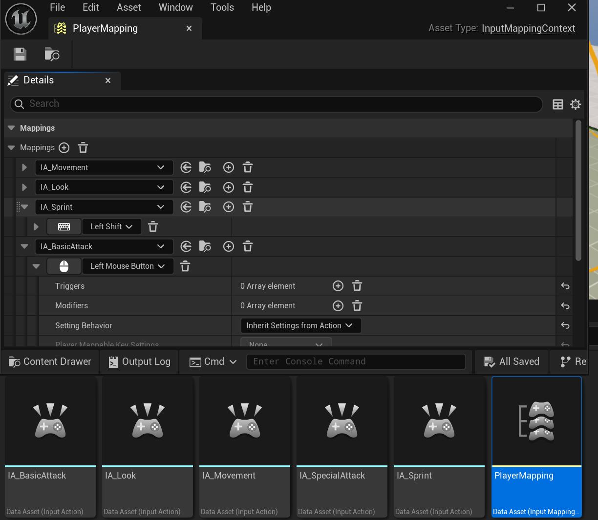  
As of right now, it only supports keyboard as that is what I am using during the testing phase.

I hook up my C++ functions to those events using this code here:  
```cpp
#define BIND_INPUT_ACTION(Component, Action, TriggerEvent, Func) \  
if (Action) \  
{ \  
Component->BindAction(Action, TriggerEvent, this, &ThisClass::Func); \  
} \  
else \  
{ \  
UE_LOG(LogMusouPlayer, Error, TEXT("Input Action \"%s\" not set"), TEXT(#Action)); \  
}

...

void AMusouPlayerController::SetupInputComponent()  
{  
    Super::SetupInputComponent();  
  
    // set up input  
    if (UEnhancedInputComponent* EIC = static_cast<UEnhancedInputComponent*>(InputComponent))  
    {  
       // Movement  
       BIND_INPUT_ACTION(EIC, p_MovementAction, ETriggerEvent::Triggered, Move);  
       BIND_INPUT_ACTION(EIC, p_SprintAction, ETriggerEvent::Started, PressedSprint);  
       BIND_INPUT_ACTION(EIC, p_SprintAction, ETriggerEvent::Triggered, TryStartSprint);  
       BIND_INPUT_ACTION(EIC, p_SprintAction, ETriggerEvent::Completed, CompleteSprint);  
  
       // Looking  
       BIND_INPUT_ACTION(EIC, p_LookAction, ETriggerEvent::Triggered, Look);  
  
       // Attacks  
       BIND_INPUT_ACTION(EIC, p_BasicAttackAction, ETriggerEvent::Started, BasicAttackStart);  
       BIND_INPUT_ACTION(EIC, p_BasicAttackAction, ETriggerEvent::Completed, BasicAttackRelease);  
       BIND_INPUT_ACTION(EIC, p_SpecialAttackAction, ETriggerEvent::Started, SpecialAttackStart);  
       BIND_INPUT_ACTION(EIC, p_SpecialAttackAction, ETriggerEvent::Completed, SpecialAttackRelease);  
    }  
    else UE_LOG(LogMusouPlayer, Error, TEXT("Enhanced Input Local Player Subsystem not found"));  
}
```

## Data Assets (Attacks, Characters, Enemies)
Since I wanted my project to be easily expandable, I made sure to use Data Assets as much as possible. This would allow me to quickly iterate on things and also reuse things like attacks later.  
Whilst I will go into more detail on the Attacks in the next section, here's how I structured the Characters and Enemies data assets:  
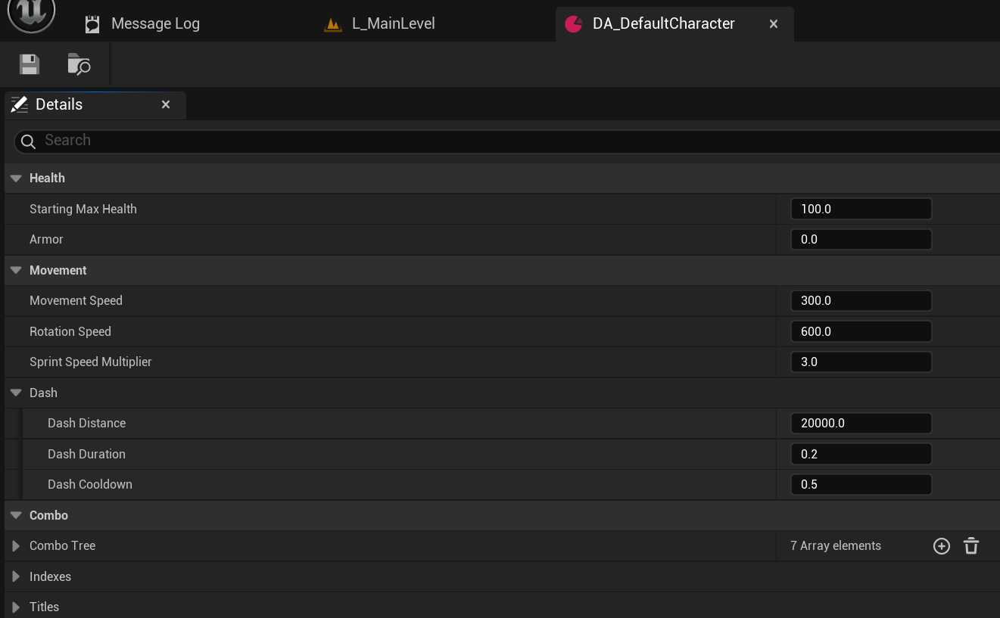  
The character has health, armor and different speed and dash settings.  
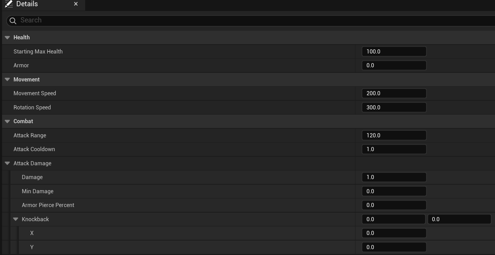  
The enemy has health, armor and different attack settings.

This allows me to easily test multiple different characters and enemy settings by simply dragging them into the Blueprint.

## Attacks
My game currently has 3 different types of attacks, Still, Sweep and Charge.  
The names represent exactly how the attack works.

All attack types share similar settings.  
#### Shapes
First, there is the attack shape itself, my game currently supports 3 shapes: Circle (Sphere), Cone and Box.  
Each having either range or extent (for the box) and a forward offset. The cone also has an angle setting.
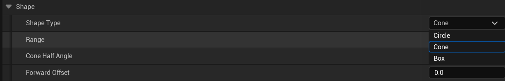

#### Damage & Knockback
Every attack has damage values and armor piercing percentages.  
They also have knockback that will allow them to knock back enemies into a direction of choosing, either from the center of the attack, or just away from the player.  
Sweep attacks do it slightly differently however, since they also can knock enemies into the direction of the sweep attack itself.  
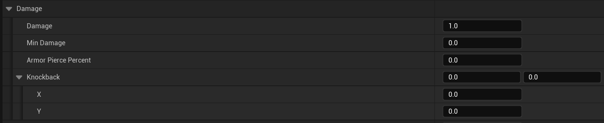

#### Other attack variables
They also all share a couple more variables.  
They can change the speed multiplier of the player during the attack, so the attack can either increase or decrease the player's speed. Keeping this value at 1 however, doesn't actually change anything.  
There's also a Duration and Damage Delay. These 2 can be used for animations later, except for duration which is required for Sweep Attacks.

### Still Attacks
Still attacks are exactly what they state they are. They do one hit and then disappear.
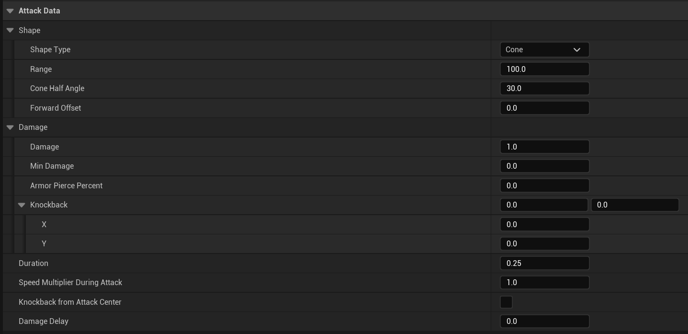

### Sweep Attacks
Sweep attacks will sweep from position A to position B in relation to where the player is.  
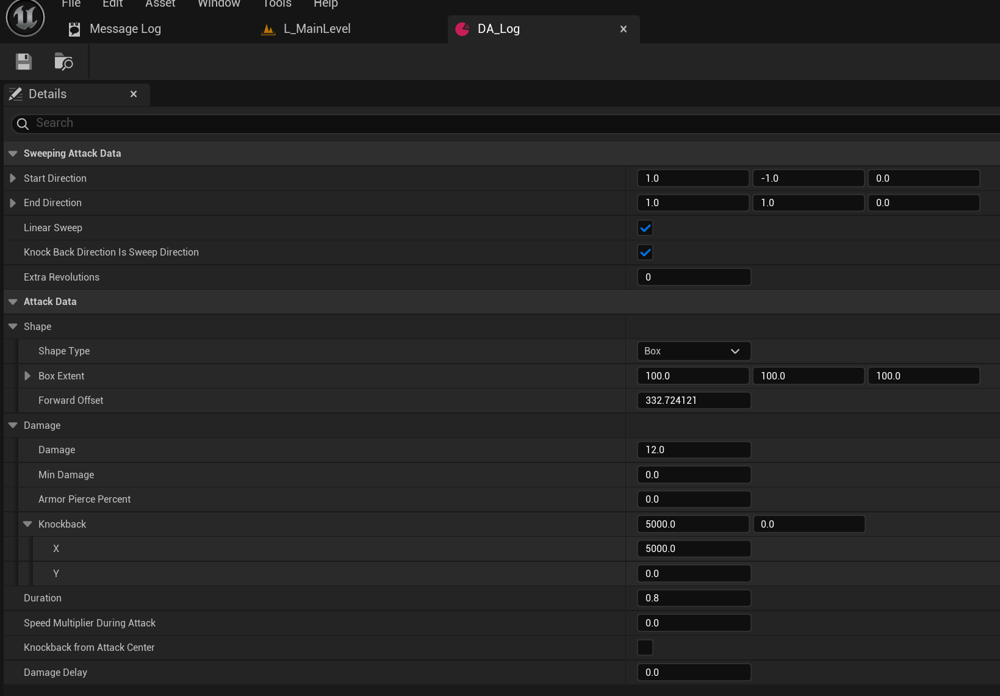  
There's many settings for changing the positions for the attack, how long it should last, whether it should rotate around the player and more.

As you can see in this image below, using my attack visualizer, this Log attack will start at the green square, and end at the red one.  
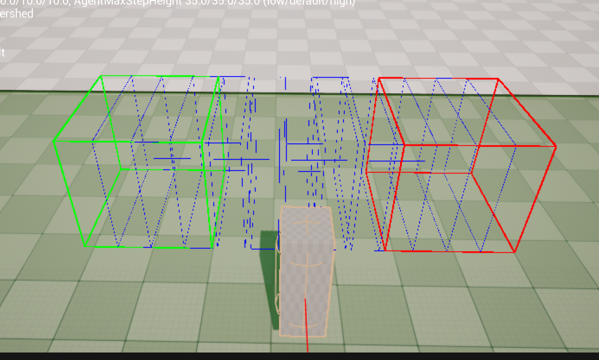

### Charge attacks
Charge attacks require the player to hold an attack to charge up an attack, going from shape, speed and damage A to shape, speed and damage B over time using a lerp.  
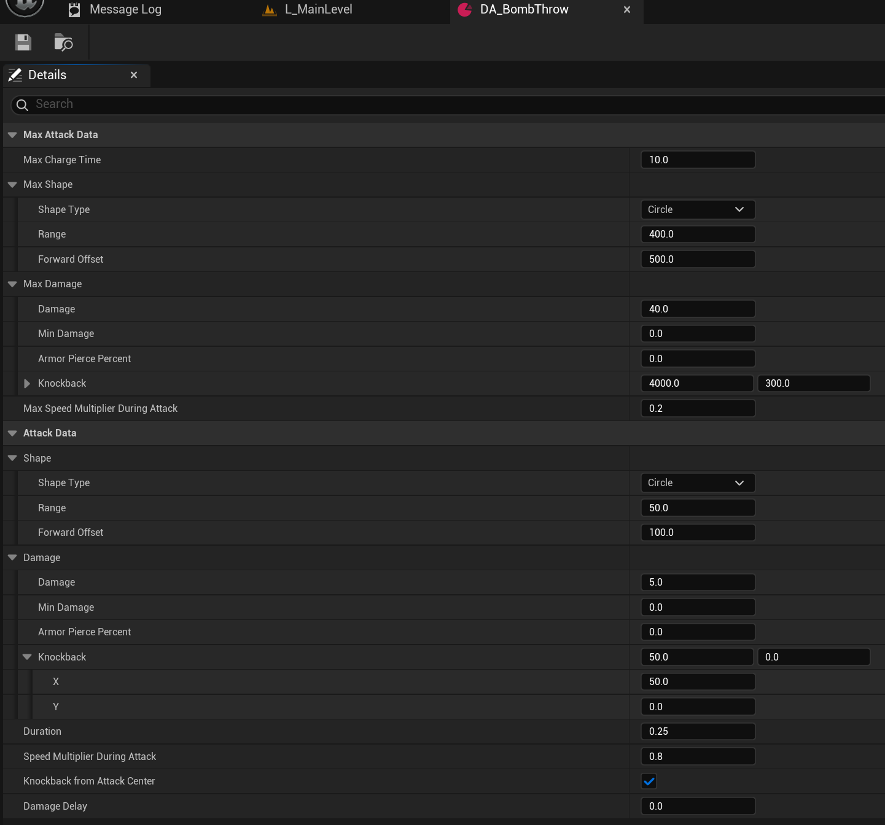

When the button is released, so is the attack and it essentially acts like a still attack.  

As you can see in the images below, using my attack visualizer, it shows the starting and ending shape of this charge attack:  

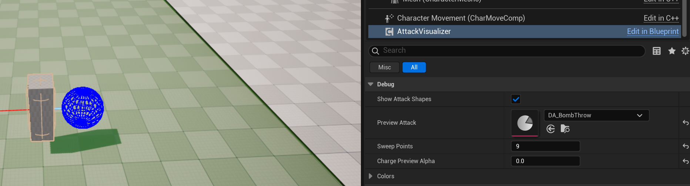  
*Start*

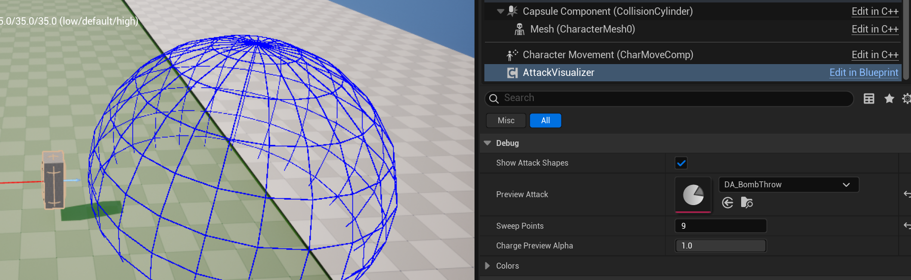  
*End*

## Combo System
The player has a combo system that allows them to press specific attacks to further increase the combo.  
Let's start by taking a look at how this combo system works.  
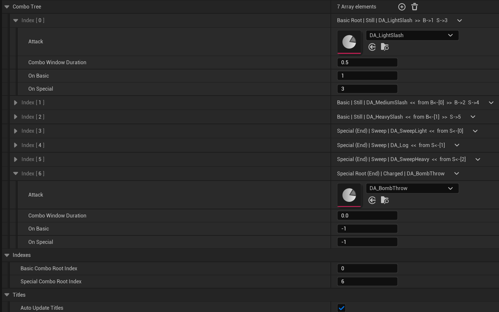  
As you can see in the image, there is a lot going on so I will explain how it works.  
First, a new element is added to the array, this will be at index 0 in the tree and likely be a basic attack. Because this is the start of the combo for basic attacks, it will have the text "Root" in the title. The attack itself is then set, for my example, I used a Still attack, so the word "Still" gets added to the title, with the asset's name right behind it. Then the >> shows the user what attacks this one will lead into, B->1 means that, after pressing this attack and then using a Basic Attack, the attack at Index 1 in the tree will be called. S->3 means that pressing Special instead will activate the attack at Index 3 in the list.  

So for my first test character added 7 attacks in this combo tree in total. 3 Basics, with each basic having a branch for if the player presses the Special Button. I also have a charge attack for if the user only presses (and holds) Special, which is why that one shows both "Root" and "(End)", because it is the start, but also the end of that combo.  
Then, each Combo attack has a window, which dictates how long the player has after the attack is done to press another button to continue the combo. There's also the On Basic and On Special as explained before.  

The setting at the bottom, "Auto Update Titles" is just to disable the titles from auto-updating, as every time a variable is modified, all the titles need to get recalculated. This is not optimal but it works for now as I continue working on other things in the meantime, so if anyone ever uses these tools on lower-end hardware, they can disable auto-updating the titles and only update them when the bool is re-enabled.
## UE5 AI Pathfinding
the AI Pathfinding, using UE5's Navmesh is actually really simple.
I have an Actor called EnemyGroup that is just a sphere collider and a list of enemies in the group. Once the player enters this sphere, all enemies get alerted and will follow and attack the player.  
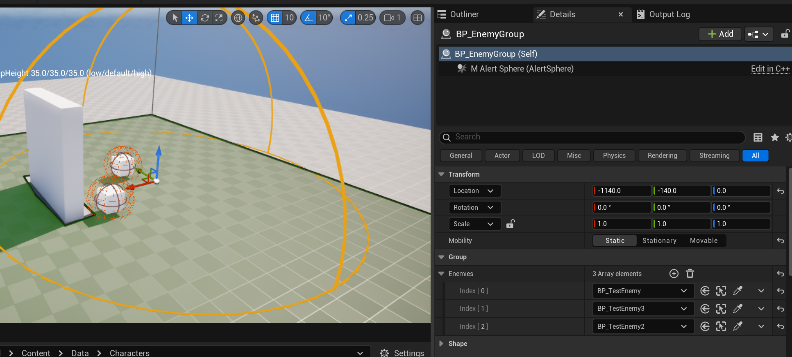

## Editor Tools
As you may have seen already, I made a couple of editor tools for this project to make creating and adding content much easier.

### Combo Tree User UI
The Combo tree specifically allows the user to see exactly what attacks are the root, what kind of attack it is, the name of the attack, what attacks it can lead in to and what attacks lead to it.  
The way I do that is that, when the user updates any variable in the combo tree (whilst AutoUpdateTitles is false), I update the titles for every single node like this:  
```cpp
void UCharacterStats::PostEditChangeProperty(FPropertyChangedEvent& PropertyChangedEvent)  
{  
    Super::PostEditChangeProperty(PropertyChangedEvent);  
  
    const FName PropertyName = PropertyChangedEvent.GetPropertyName();  
  
    if (PropertyName == GET_MEMBER_NAME_CHECKED(UCharacterStats, AutoUpdateTitles))  
    {  
       if (!AutoUpdateTitles) return;  
    }  
    else  
    {  
       if (!AutoUpdateTitles) return;  
  
       if (PropertyName != GET_MEMBER_NAME_CHECKED(UCharacterStats, ComboTree) &&  
          PropertyName != GET_MEMBER_NAME_CHECKED(UCharacterStats, BasicComboRootIndex) &&  
          PropertyName != GET_MEMBER_NAME_CHECKED(UCharacterStats, SpecialComboRootIndex) &&  
          PropertyName != GET_MEMBER_NAME_CHECKED(FComboNode, Attack) &&  
          PropertyName != GET_MEMBER_NAME_CHECKED(FComboNode, OnBasic) &&  
          PropertyName != GET_MEMBER_NAME_CHECKED(FComboNode, OnSpecial))  
          return;  
    }  
  
    for (int i = 0; i < ComboTree.Num(); i++)  
    {  
       FComboNode& node = ComboTree[i];  
  
       const FString attackName = node.Attack  
                               ? node.Attack->GetName()  
                               : TEXT("None");  
  
       // Input type from tree structure  
       FString InputLabel;  
       if (i == BasicComboRootIndex) InputLabel = TEXT("Basic Root");  
       else if (i == SpecialComboRootIndex) InputLabel = TEXT("Special Root");  
       else  
       {  
          for (int j = 0; j < ComboTree.Num(); j++)  
          {  
             if (ComboTree[j].OnBasic == i)  
             {  
                InputLabel = TEXT("Basic");  
                break;  
             }  
             if (ComboTree[j].OnSpecial == i)  
             {  
                InputLabel = TEXT("Special");  
                break;  
             }  
          }  
       }  
  
       // Attack type from class  
       FString attackType;  
       if (node.Attack)  
       {  
          if (Cast<USweepingAttackData>(node.Attack))  
             attackType = TEXT("Sweep");  
          else if (Cast<UChargedAttackData>(node.Attack))  
             attackType = TEXT("Charged");  
          else  
             attackType = TEXT("Still");  
       }  
  
       const bool isEnd = (node.OnBasic < 0 && node.OnSpecial < 0);  
  
       // From  
       TArray<int32> leadsFrom;  
       for (int j = 0; j < ComboTree.Num(); j++)  
       {  
          if (ComboTree[j].OnBasic == i || ComboTree[j].OnSpecial == i)  
             leadsFrom.Add(j);  
       }  
  
       FString FromStr;  
       if (leadsFrom.Num() > 0 && i != BasicComboRootIndex && i != SpecialComboRootIndex)  
       {  
          TArray<FString> Parts;  
          for (const int32 idx : leadsFrom)  
          {  
             const bool fromBasic = ComboTree[idx].OnBasic == i;  
             const bool fromSpecial = ComboTree[idx].OnSpecial == i;  
  
             if (fromBasic && fromSpecial)  
                Parts.Add(FString::Printf(TEXT("B+S<-[%d]"), idx));  
             else if (fromBasic)  
                Parts.Add(FString::Printf(TEXT("B<-[%d]"), idx));  
             else  
                Parts.Add(FString::Printf(TEXT("S<-[%d]"), idx));  
          }  
          FromStr = FString::Printf(TEXT("from %s"), *FString::Join(Parts, TEXT(", ")));  
       }  
  
       // Leads to  
       TArray<FString> leadsToParts;  
       if (node.OnBasic >= 0)  
          leadsToParts.Add(FString::Printf(TEXT("B->%d"), node.OnBasic));  
       if (node.OnSpecial >= 0)  
          leadsToParts.Add(FString::Printf(TEXT("S->%d"), node.OnSpecial));  
       FString LeadsToStr = FString::Join(leadsToParts, TEXT("  "));  
  
       node.NodeName = FString::Printf(TEXT("%s%s | %s | %s%s%s"),  
                                       *InputLabel,  
                                       isEnd ? TEXT(" (End)") : TEXT(""),  
                                       *attackType,  
                                       *attackName,  
                                       FromStr.IsEmpty() ? TEXT("") : *FString::Printf(TEXT("  <<  %s"), *FromStr),  
                                       LeadsToStr.IsEmpty()  
                                          ? TEXT("")  
                                          : *FString::Printf(TEXT("  >>  %s"), *LeadsToStr));  
    }  
}  
```

### Attack Visualizer
Obviously it is nice to have a visual representation of the shape of the attack you are working on. For that reason, I made the attack visualizer.

It is a component that I put on both a dummy character (for testing in Editor) and the actual player character so that they can visualize their attacks during runtime while I don't have actual VFX yet.  
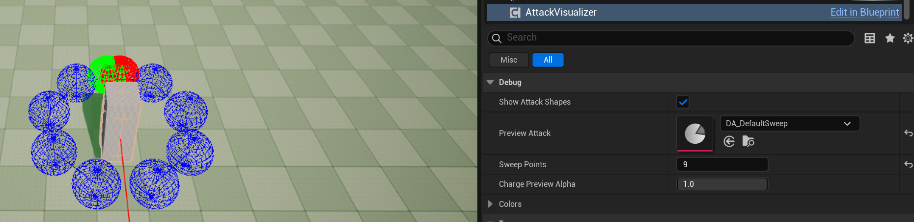  
For editor testing, we can just drag and drop in any attack and then check the shape. For sweep attacks we can add more sweep points and for charge attacks we can change what point in time we are currently looking at.

<!--Make icon redirect to About Me, don't touch this!-->
<script> document.querySelectorAll('#sidebar #avatar, #sidebar .site-title').forEach(function(link) { link.href = '/about/'; }); </script>